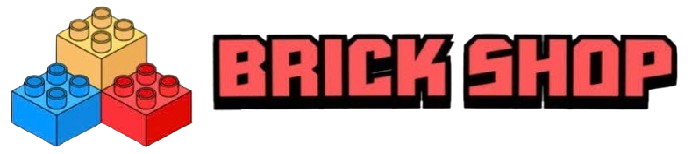
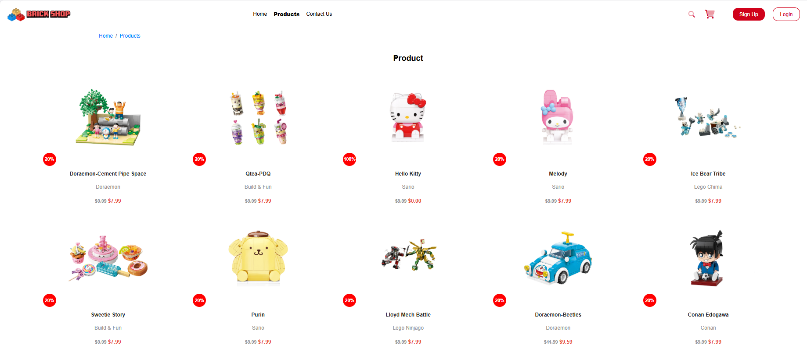
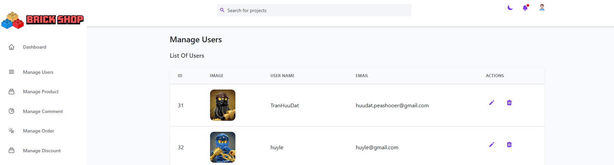
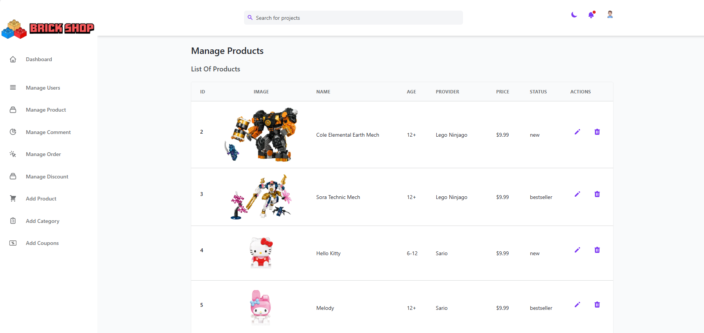

# BrickShop - Building Block Toy Paradise 🧱

Welcome to BrickShop, an e-commerce website project dedicated to providing creative building block toys from leading brands like **Qman**, **Keeppley**, and **LEGO**. Explore a world of creativity with diverse themes ranging from Superheroes, Conan, Sanrio, Doraemon to Ninjago, Chima, City, and many more!

<p align="center">
  
  <!-- Make sure the logo path is correct -->
</p>

## Table of Contents

*   [Introduction](#introduction)
*   [Technology Stack](#technology-stack)
*   [Customer Experience](#customer-experience)
    *   [Key Features (For Customers)](#key-features-for-customers)
    *   [Main Pages Description (User)](#main-pages-description-user)
    *   [Screenshots (Customer Interface)](#screenshots-customer-interface)
*   [Admin Panel](#admin-panel)
    *   [Key Features (For Administrators)](#key-features-for-administrators-admin)
    *   [Main Pages Description (Admin)](#main-pages-description-admin)
    *   [Screenshots (Admin Interface)](#screenshots-admin-interface)
*   [Installation & Setup Guide](#installation--setup-guide)
    *   [Prerequisites](#prerequisites)
    *   [Installation Steps](#installation-steps)
    *   [Environment Variables](#environment-variables)
    *   [Running the Project](#running-the-project)
*   [License](#license)
*   [Contact](#contact)

## Introduction

BrickShop is an e-commerce platform where building block enthusiasts can find an extensive collection from Qman, Keeppley, and LEGO brands. The project offers a complete online shopping experience, from product discovery to payment and order tracking, along with a robust administration system for efficient business management.

## Technology Stack

*   **Frontend:**
    *   HTML5
    *   CSS3
        *   **Bootstrap:** Main CSS framework for the user-facing interface (customer pages).
        *   **Tailwind CSS:** Main CSS framework for the administrator interface (admin pages).
    *   JavaScript
*   **Backend:**
    *   Node.js, Express.js
*   **Database:**
    *   MySQL

## Key Features

### For Customers

*   👤 **Authentication & Account Management:**
    *   Register, Login, Logout.
    *   **Profile Settings:** Update personal information (name, email), change password, manage shipping addresses, customize profile picture (upload or choose from available collections), add/edit social media links.
*   🧱 **Browsing & Shopping:**
    *   View introductions to Qman, Keeppley, and LEGO brands on the homepage.
    *   Browse all products or filter by brand/theme.
    *   View product details: Images (gallery), description, price, SKU, suitable age, supplier, variations (if any), add to cart.
    *   Product Search.
*   🛒 **Cart & Checkout:**
    *   View/edit products in the shopping cart.
    *   Apply valid **Voucher/Coupon** codes for discounts.
    *   Proceed through the checkout process.
    *   **QR Code Payment** option.
*   🚚 **Order Management:**
    *   Review past order history.
    *   **Track order details:** View recipient information, address, shipping method, total amount, order date, and the list of products in the order.

## Main Pages Description (User)

*   **Home Page (Index):** The first landing page, providing a general overview of BrickShop and featured brands (Qman, Keeppley, LEGO), along with promotions (e.g., Black Friday). Displays featured themes/products for exploration.
*   **Products Page:** Lists the available building block toy products. Allows users to view multiple products, potentially with filtering or pagination.
*   **Product Detail Page:** Shows comprehensive information about a specific product, including multiple images, detailed description, price, attributes (brand, theme, SKU, age...), quantity selection, and "Add to Cart" / "Buy Now" buttons.
*   **Account Settings Page:** Enables users to manage their personal information, change passwords, update profile pictures (upload new or select from predefined collections like People, Cute, Lego Ninjago), and manage social media links (Twitter, Facebook, Google+, LinkedIn, Instagram).
*   **Order History/Detail Page:** Provides detailed information about a specific order placed by the user, including shipping info, product list, quantities, prices, and the total amount.


### Customer Interface (Bootstrap)
| Home Page                              | LEGO Introduction                      | Qman Introduction                      |
| :------------------------------------: | :----------------------------------: | :----------------------------------: |
|  |   |    |
| **Keeppley Introduction**              | **Products Page**                    | **Product Detail Page**              |
| | |  |
| **Account Settings - Info**          | **Account Settings - Avatar**       | **Account Settings - Social Links** |
| | | |
| **Order Detail**                       |                                      |                                      |
|  |                                      |                                      |


### For Administrators (Admin)

*   📊 **Dashboard:** Displays a quick overview: Total orders, user count, product count, comment count (?). (Staff list might be sample data).
*   👥 **Manage Users:** View a list of all registered users with ID, Avatar, Username, Email. Provides actions like Edit and Delete user accounts.
*   🧱 **Manage Products:** Displays a list of all products with ID, Image, Name, Age, Provider, Price, Status (e.g., new, bestseller), and Edit, Delete actions.
*   💬 **Manage Comments:** (Based on menu) Allows administrators to view and potentially approve/delete product comments.
*   📦 **Manage Orders:** Lists all placed orders with ID, Customer Name, Date, Price, Shipping Address, Delivery Method, Order Status (e.g., Pending, Delivered). Allows viewing details for each order.
*   🏷️ **Manage Discounts / Coupons:** (Based on menu) Manage discount programs or coupon codes (vouchers).
*   ➕ **Add Product:** A form allowing administrators to input information to add a new product, including Product Number, Name (English, Vietnamese), and upload multiple product images.
*   📚 **Add Category:** (Based on menu) Allows administrators to add new brands or product themes.
*   🎟️ **Add Coupons:** (Based on menu) A form to create new discount codes/vouchers.


## Main Pages Description (Admin)

*   **Dashboard:** Offers a high-level view of the store's activity through key metric cards (Total Orders, Users, Products, Comments). The main interface for navigating to other management sections via the sidebar menu.
*   **Manage Users:** Displays the user list in a table format, allowing admins to view basic information and perform management actions like editing or deleting accounts.
*   **Manage Products:** Presents the product catalog in a table with essential details. Admins can easily search, review, and edit or remove products from the store.
*   **Manage Order:** Lists orders chronologically, showing their processing status (Pending, Delivered...). Provides quick access to order details for review and status updates.
*   **Add Product:** A detailed form interface for adding new products to the system, including multi-language name input and the ability to upload multiple images.


### Admin Interface (Tailwind CSS)
| Dashboard                             | Manage Users                         | Manage Products                       |
| :-----------------------------------: | :----------------------------------: | :-----------------------------------: |
| | | |
| **Manage Orders**                    | **Add Product**                      |                                       |
| |  |                                       |

<!-- Make sure image paths are correct -->

## Installation & Setup Guide

### Prerequisites

*   Node.js (Version >= 16.x recommended)
*   npm / yarn
*   MySQL Server (Installed and running)
*   Git

### Installation Steps

1.  **Clone the repository:**
    ```bash
    git clone https://github.com/TranHuuDat2004/Keeppley_Nodejs
    cd your_project_directory_name # e.g., cd Keeppley_Nodejs
    ```
2.  **Install Backend Dependencies:**
    ```bash
    cd backend # Or your backend directory name
    npm install
    # or: yarn install
    ```
3.  **Database Setup:**
    *   Log in to your MySQL server.
    *   Create a new database (e.g., `keeppley-shop` or `brickshop_db`).
    *   Import the database schema or run migrations to create the necessary tables (e.g., `users`, `products`, `categories`, `orders`, `vouchers`...).

### Environment Variables

1.  In the `backend` directory, create a `.env` file.
2.  Add the required environment variables. Example:
    ```dotenv
    DB_HOST=localhost
    DB_USER=your_mysql_user
    DB_PASSWORD=your_mysql_password
    DB_NAME=brickshop_db # Use the name you created
    DB_PORT=3306
    PORT=3001 # Port for the backend server
    JWT_SECRET=your_super_secret_key_for_jwt # Important for security
    # Add other keys if needed (e.g., QR Payment Gateway keys)
    ```
3.  Replace placeholder values (`your_mysql_user`, `your_mysql_password`, etc.) with your actual configuration.

### Running the Project

1.  **Start the Backend Server:**
    ```bash
    cd backend
    npm start
    # Or if you have a development script: npm run dev
    ```
    The server will run on the port specified in your `.env` file (e.g., `http://localhost:3001`).

2.  **Open the Frontend:**
    *   Open the user interface HTML files (e.g., `index.html`, `products.html`) directly in your web browser.
    *   Open the admin interface HTML files (e.g., `admin/index.html`) directly in your web browser.
    *   **Important:** Ensure the JavaScript files in the frontend are configured to make API calls to the correct backend address (e.g., `fetch('http://localhost:3001/api/products')`).

## License

This project is licensed under the MIT License. See the `LICENSE` file for details.
(Ensure you have created a `LICENSE` file in the project root with the MIT License text).

## Contact

[Team Lead: Tran Huu Dat / Members: Thuy Linh - Huy Le] - [huudat.peashooer@gmail.com]

Project Link: [https://github.com/TranHuuDat2004/Keeppley_Nodejs](https://github.com/TranHuuDat2004/Keeppley_Nodejs)